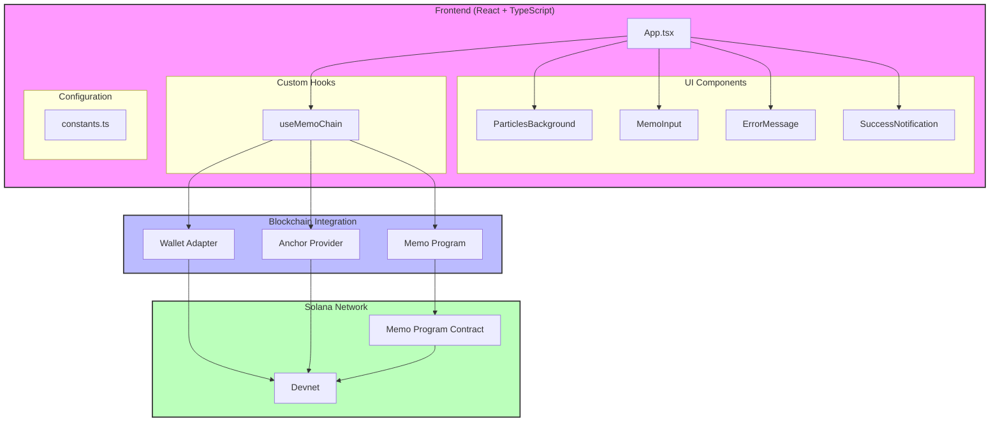

# MemoChain Application Architecture



## Component Structure

### App (`App.tsx`)
Main application component that orchestrates all other components and manages the overall UI state.

```
App
├── ParticlesBackground
├── WalletMultiButton (from @solana/wallet-adapter-react-ui)
├── ErrorMessage
├── MemoInput
├── SuccessNotification
└── useMemoChain (Custom Hook)
```

## Data Flow

```
User Input → MemoInput
             ↓
       useMemoChain Hook
             ↓
    Wallet Adapter/Provider
             ↓
      Solana Blockchain
             ↓
     Transaction Result
             ↓
UI Updates (Success/Error)
```

## State Management

```
useMemoChain Hook
├── States
│   ├── error
│   ├── isLoading
│   └── successNotification
│
└── Actions
    ├── sendMemo
    ├── setError
    └── setSuccessNotification
```

## Component Details

### MemoInput Component
- Text input field
- Character counter
- Keyboard shortcuts (Enter/Escape)
- Input validation

### ErrorMessage Component
- Error display
- Retry functionality
- Different error severities

### SuccessNotification Component
- Transaction success message
- Transaction link
- Copy transaction ID

### ParticlesBackground Component
- Animated background particles
- Pure UI component

## Technical Stack

### Frontend
- React 19.1
- TypeScript 5.8
- Vite 7.0

### Blockchain Integration
- @solana/web3.js
- @coral-xyz/anchor
- Solana Wallet Adapter

### Development Tools
- ESLint
- Prettier
- TypeScript ESLint

## File Structure

```
src/
├── components/
│   ├── ErrorMessage.tsx
│   ├── MemoInput.tsx
│   ├── ParticlesBackground.tsx
│   └── SuccessNotification.tsx
├── hooks/
│   └── useMemoChain.ts
├── CONSTANTS/
│   └── constants.ts
├── types/
│   └── types.ts
├── idl/
│   ├── anchor_spl_memo.json
│   └── anchor_spl_memo.ts
├── App.tsx
└── main.tsx
```

## Constants & Configuration

```typescript
const CONSTANTS = {
  MEMO_MAX_LENGTH: 280,
  WALLET_HIGHLIGHT_DURATION: 3000,
  SUCCESS_NOTIFICATION_DURATION: 5000,
  COPY_NOTIFICATION_DURATION: 2000,
  SHAKE_DURATION: 500,
  MEMO_PROGRAM_ID: 'MemoSq4gqABAXKb96qnH8TysNcWxMyWCqXgDLGmfcHr',
  EXPLORER_URL: 'https://explorer.solana.com'
}
```

## Error Handling

### Error Types
```typescript
type ErrorType = {
  message: string;
  severity: 'warning' | 'error';
  code: string;
  isRetriable?: boolean;
}
```

### Error Scenarios
1. No wallet connected
2. Empty memo
3. Insufficient funds
4. User rejection
5. Network timeout
6. Unknown errors

## Blockchain Integration

### Transaction Flow
```
1. User initiates transaction
2. Wallet signs transaction
3. Transaction sent to Solana
4. Wait for confirmation
5. Update UI with result
```

## Security Measures

1. Input validation
2. Transaction confirmation
3. Error handling
4. Secure clipboard operations
5. Safe external links

## Performance Optimizations

1. Debounced inputs
2. Efficient state updates
3. Memoized components
4. Optimized animations
5. Error boundary implementation
