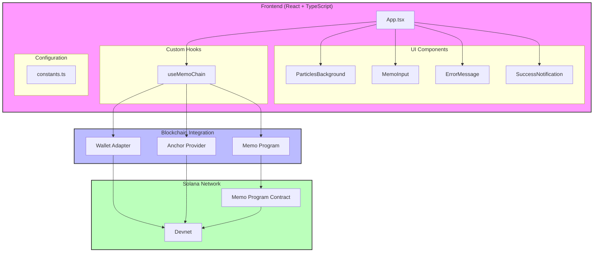

# MemoChain - Solana Memo dApp

MemoChain is a decentralized application (dApp) built on the Solana blockchain that allows users to store immutable memos on-chain. With its modern, responsive UI and robust error handling, MemoChain provides a seamless user experience for interacting with blockchain technology.

## 🚀 Features

- Write and store memos on Solana blockchain
- Seamless wallet integration
- Real-time transaction status updates
- Copy transaction IDs with one click
- Keyboard shortcuts for improved UX
- Character limit counter with visual feedback
- Comprehensive error handling
- Retry mechanism for failed transactions
- Responsive glassmorphic design

## 🏗️ Technical Architecture



### Component Structure
```
App
├── ParticlesBackground
├── WalletMultiButton (from @solana/wallet-adapter-react-ui)
├── ErrorMessage
├── MemoInput
├── SuccessNotification
└── useMemoChain (Custom Hook)
```

### Frontend Stack
- **React 19.1**: Core UI framework
- **TypeScript 5.8**: Type-safe development
- **Vite 7.0**: Build tool
- **@solana/wallet-adapter**: Wallet integration
- **@coral-xyz/anchor**: Solana program interaction

### Smart Contract
- **Anchor Framework**: Solana program development
- **Solana Program Library (SPL)**: Memo program integration

### Data Flow
```
User Input → MemoInput
             ↓
       useMemoChain Hook
             ↓
    Wallet Adapter/Provider
             ↓
      Solana Blockchain
             ↓
     Transaction Result
             ↓
UI Updates (Success/Error)
```

### Project Structure
```
src/
├── components/
│   ├── ErrorMessage.tsx
│   ├── MemoInput.tsx
│   ├── ParticlesBackground.tsx
│   └── SuccessNotification.tsx
├── hooks/
│   └── useMemoChain.ts
├── CONSTANTS/
│   └── constants.ts
├── types/
│   └── types.ts
├── idl/
│   ├── anchor_spl_memo.json
│   └── anchor_spl_memo.ts
├── App.tsx
└── main.tsx
```

### Transaction Flow
```
1. User initiates transaction
2. Wallet signs transaction
3. Transaction sent to Solana
4. Wait for confirmation
5. Update UI with result
```

## 🎯 Performance Considerations

1. **Transaction Optimization**
   - Efficient memo program calls
   - Minimized blockchain interactions
   - Optimized transaction confirmation flow

2. **UI Performance**
   - Debounced input handling
   - Efficient state management
   - Optimized re-renders
   - Smooth animations with CSS transforms

3. **Error Handling**
   - Graceful degradation
   - Quick recovery from failures
   - Clear user feedback

## 🔒 Security Measures

1. **Wallet Security**
   - Secure wallet connection handling
   - Transaction signing confirmation
   - Automatic wallet disconnection handling

2. **Transaction Safety**
   - Input validation and sanitization
   - Double-submission prevention
   - Clear transaction feedback

3. **Error Prevention**
   - Comprehensive input validation
   - Clear error messages
   - User action confirmation
   - Rate limiting for transactions

4. **Data Safety**
   - No sensitive data storage
   - Secure clipboard operations
   - Safe external link handling

## 🔄 State Management
- Clean state initialization
- Atomic state updates
- Proper cleanup on unmount
- Persistent state handling

## 🚦 Error States
1. **Transaction Errors**
   - Insufficient funds
   - User rejections
   - Network timeouts
   - Unknown errors

2. **Input Validation**
   - Empty memo prevention
   - Character limit enforcement
   - Special character handling

## 🎨 UI/UX Features
- Responsive design
- Loading states
- Success animations
- Error indicators
- Keyboard shortcuts
- Tooltips and hints

## 🔜 Future Improvements

1. **Feature Enhancements**
   - Memo history viewer
   - Multiple memo types
   - Rich text support
   - Memo threading
   - Social features (likes, replies)

2. **Technical Improvements**
   - Caching layer for transaction history
   - Offline support with queue
   - Performance monitoring
   - Analytics integration
   - Automated testing suite

3. **UI/UX Enhancements**
   - Dark/light theme toggle
   - Custom animation settings
   - Localization support
   - Accessibility improvements
   - Mobile-optimized views

4. **Blockchain Features**
   - Multiple network support
   - Token gating options
   - DAO integration
   - Cross-chain compatibility

## 🛠️ Getting Started

1. Clone the repository:
   ```bash
   git clone https://github.com/xavierScript/dev-quest.git
   ```

2. Install dependencies:
   ```bash
   cd dev-quest
   cd anchor-memo-ui
   npm install
   ```

3. Run the development server:
   ```bash
   npm run dev
   ```

4. Build for production:
   ```bash
   npm run build
   ```

## 📝 Environment Setup

Create a `.env` file with:
```
VITE_RPC_URL=your_rpc_url
VITE_NETWORK=devnet  # or mainnet-beta
```

## 🤝 Contributing

1. Fork the repository
2. Create your feature branch
3. Commit your changes
4. Push to the branch
5. Create a Pull Request

## 📜 License

## ✨ Acknowledgments

- Solana Foundation
- Anchor Framework
- Solana Program Library
- React Community
- Codigo ai
---

Built with ❤️ by xavierScript

---

## 🧱 Data Structure

| Account         | Description                                                |
|------------------|------------------------------------------------------------|
| `payer`          | The transaction signer and payer for the memo instruction |
| `memo_program`   | The Memo program invoked via CPI                           |

---

## 🧾 Instructions

| Name        | Description                                                  |
|-------------|--------------------------------------------------------------|
| `send_memo` | Sends a memo string via the Memo program (can include signers) |
